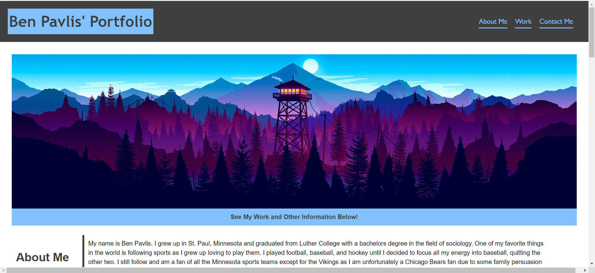

# Module 2 Challenge - Advanced CSS Portfolio Building

## Description of Work
Created a personal portfolio website using css and html to showcase my future projects.

## Final Screenshot

## Links
[GitHub](https://github.com/bpavlis/adv-css-portfolio)

[GitHub Pages](https://bpavlis.github.io/adv-css-portfolio/)